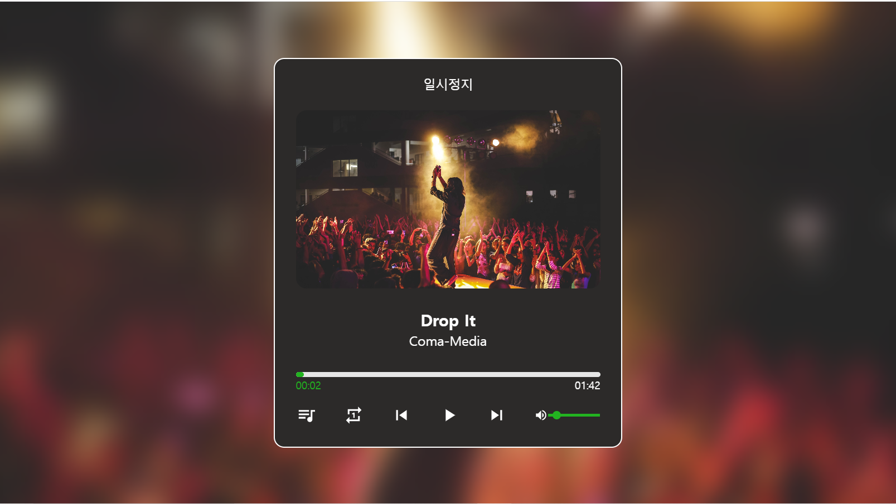

# Music Player

## 뮤직플레이어

> redux를 이용한 musicPlayer프로젝트 입니다.  
> 프로젝트에 사용된 이미지와 음원은 pixabay의 무료 이미지와 음원을 사용했습니다.  
> store/data에 등록되어있는 데이터에서 name, artist, img, src, id를 받아 해당 곡의 배경 및 정보를 보여주고 플레이 리스트 수정 및 재생을 할 수 있는 기능을 구현했다.

## 기능 구현

### controls

> 죄측부터 플레이리스트, 재생모드, 이전곡, 재생 및 일시정지, 다음곡, 볼륨조절
> 재생모드는 전체재생, 한 곡 반복, 랜덤 재생이 있다.
> 전체 재생은 플레이 리스트 순서대로 곡이 재생되고
> 한 곡 반복은 현재 재생중이 곡만 반복한다. 랜덤 재생은 플레이리스트에서 랜덤으로 곡을 재생합니다.

### ProgressArea

> progressArea 클릭시 해당 구간으로 이동하며 곡의 재생시간과 현재 재생중인 시간을 보여준다.
> 또한 한 곡 반복시 setTimeout함수를 주어 2초의 딜레이 후 다시 재생합니다.

### playList

> store에서 PlayList를 받아 playList에 있는 곡을 보여준다.  
> 현재 재생중인 곡은 초록색으로 표시가 되며 곡을 클릭시 해당 곡이 재생이 된다.  
> 또한 곡을 드래그 드롭으로 플레이 리스트 순서를 변경할 수 있다.
